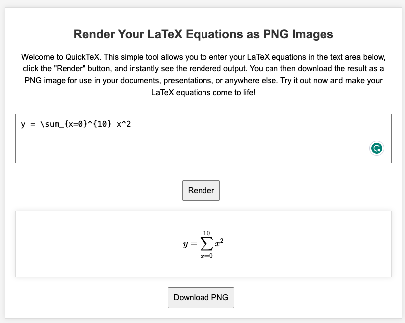

# QuickTeX
[QuickTeX](https://arun-george-zachariah.github.io/QuickTeX/) is simple tool that allows you to render your LaTeX equations as PNG images, that could be used for presentations in powerpoint slides and keynote talks.

